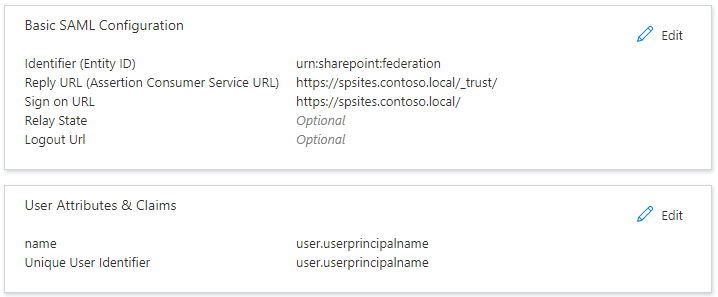

# Tutorial: Implement federated authentication between Azure Active Directory and SharePoint on-premises

## Scenario description

In this tutorial, you configure a federated authentication between Azure Active Directory and SharePoint on-premises. The goal is to allow users to sign-in on Azure Active Directory and use their identity to access the SharePoint on-premises sites.

## Prerequisites

To perform the configuration, you need the following resources:
* An Azure Active Directory tenant. If you don't have one, you can create a [free account](https://azure.microsoft.com/free/).
* A SharePoint 2013 farm or newer.

This article uses the following values:
- Enterprise application name (in Azure AD): `SharePoint corporate farm`
- Trust identifier (in Azure AD) / realm (in SharePoint): `urn:sharepoint:federation`
- loginUrl (to Azure AD): `https://login.microsoftonline.com/dc38a67a-f981-4e24-ba16-4443ada44484/wsfed`
- SharePoint URL: `https://spsites.contoso.local/`
- SharePoint reply URL: `https://spsites.contoso.local/_trust/`
- SharePoint trust configuration name: `AzureADTrust`
- userprincipalname of the Azure AD test user: `AzureUser1@TENANT.onmicrosoft.com`

## Configure an enterprise application in Azure Active Directory

To configure the federation in Azure AD, you need to create a dedicated Enterprise application. Its configuration is simplified using the pre-configured template `SharePoint on-premises` that can be found in the application gallery.

### Create the enterprise application

1. Sign-in to the [Azure Active Directory portal](https://aad.portal.azure.com/).
1. Go to **Enterprise applications**, and then select **All applications**.
1. To add a new application, select **New application** at the top of the dialog box.
1. In the search box, enter **SharePoint on-premises**. Select **SharePoint on-premises** from the result pane.
1. Specify a name for your application (in this tutorial, it is `SharePoint corporate farm`), and click **Create** to add the application.
1. In the new enterprise application, select **Properties**, and check the value for **User assignment required?**. For this scenario, set its value to **No** and click **Save**.

### Configure the enterprise application

In this section, you configure the SAML authentication and define the claims that will be sent to SharePoint upon successful authentication.

1. In the Overview of the Enterprise application, select **2. Set up single sign-on** and choose the **SAML** in the next dialog.
 
1. On the **Set up Single Sign-On with SAML** page, select the **Edit** icon in the **Basic SAML Configuration** pane.

1. In the **Basic SAML Configuration** section, follow these steps:

    1. In the **Identifier** box, ensure that this value is present:
    `urn:sharepoint:federation`.

    1. In the **Reply URL** box, enter a URL by using this pattern:
    `https://spsites.contoso.local/_trust/`.

    1. In the **Sign on URL** box, enter a URL by using this pattern:
    `https://spsites.contoso.local/`.
	
    1. Select **Save**.
    1. The settings should look like this:
    
        

1. Copy the information that you will need later to configure SharePoint:

	- In the **SAML Signing Certificate** section, **Download** the **Certificate (Base64)**. This is the public key of the signing certificate used by Azure AD to sign the SAML token. SharePoint will need it to verify the integrity of the incoming SAML tokens.

	- In the **Set up SharePoint corporate farm** section, copy the **Login URL** in a notepad and replace the trailing string **/saml2** with **/wsfed**
	 
	> [!NOTE]
    > Make sure to replace **/saml2** with **/wsfed** to ensure that Azure AD issues a SAML 1.1 token, as required by SharePoint.

    - In the **Set up SharePoint corporate farm** section, copy the **Logout URL**

## Configure SharePoint to trust Azure Active Directory

### Create the trust in SharePoint

In this step, you create a SPTrustedLoginProvider to store the configuration that SharePoint needs to trust Azure AD. For that, you need the information from Azure AD that you copied above. Start the SharePoint Management Shell and run the following script to create it:

```powershell
# Path to the public key of the Azure AD SAML signing certificate (self-signed), downloaded from the Enterprise application in the Azure AD portal
$signingCert = New-Object System.Security.Cryptography.X509Certificates.X509Certificate2("C:\AAD app\SharePoint corporate farm.cer")
# Unique realm (corresponds to the "Identifier (Entity ID)" in the Azure AD Enterprise application)
$realm = "urn:sharepoint:federation"
# Login URL copied from the Azure AD enterprise application. Make sure to replace "saml2" with "wsfed" at the end of the URL:
$loginUrl = "https://login.microsoftonline.com/dc38a67a-f981-4e24-ba16-4443ada44484/wsfed"

# Define the claim types used for the authorization
$userIdentifier = New-SPClaimTypeMapping -IncomingClaimType "http://schemas.xmlsoap.org/ws/2005/05/identity/claims/name" -IncomingClaimTypeDisplayName "name" -LocalClaimType "http://schemas.xmlsoap.org/ws/2005/05/identity/claims/upn"
$role = New-SPClaimTypeMapping "http://schemas.microsoft.com/ws/2008/06/identity/claims/role" -IncomingClaimTypeDisplayName "Role" -SameAsIncoming

# Let SharePoint trust the Azure AD signing certificate
New-SPTrustedRootAuthority -Name "Azure AD signing certificate" -Certificate $signingCert

# Create a new SPTrustedIdentityTokenIssuer in SharePoint
$trust = New-SPTrustedIdentityTokenIssuer -Name "AzureADTrust" -Description "Azure AD" -Realm $realm -ImportTrustCertificate $signingCert -ClaimsMappings $userIdentifier, $role -SignInUrl $loginUrl -IdentifierClaim $userIdentifier.InputClaimType
```

### Configure the SharePoint web application

In this step you configure a web application in SharePoint to trust the Azure AD Enterprise application created above. There are important rules to have in mind:
- The default zone of the SharePoint web application must have Windows authentication enabled. This is required for the Search crawler.
- The SharePoint URL that will use Azure AD authentication must be be set with HTTPS.

1. Create or extend the web application. This article describes 2 possible configurations:

	- If you create a new web application that uses both Windows and Azure AD authentication in the Default zone:

        1. Start the **SharePoint Management Shell** and run the following script:
            ```powershell
            # This script creates a new web application and sets Windows and Azure AD authentication on the Default zone
            # URL of the SharePoint site federated with Azure AD
            $trustedSharePointSiteUrl = "https://spsites.contoso.local/"
            $applicationPoolManagedAccount = "Contoso\spapppool"

            $winAp = New-SPAuthenticationProvider -UseWindowsIntegratedAuthentication -DisableKerberos:$true
            $sptrust = Get-SPTrustedIdentityTokenIssuer "AzureADTrust"
            $trustedAp = New-SPAuthenticationProvider -TrustedIdentityTokenIssuer $sptrust    
            
            New-SPWebApplication -Name "SharePoint - Azure AD" -Port 443 -SecureSocketsLayer -URL $trustedSharePointSiteUrl -ApplicationPool "SharePoint - Azure AD" -ApplicationPoolAccount (Get-SPManagedAccount $applicationPoolManagedAccount) -AuthenticationProvider $winAp, $trustedAp
            ```
        1. Open the **SharePoint Central Administration** site.
        1. Under **System Settings**, select **Configure Alternate Access Mappings**. The **Alternate Access Mapping Collection** box opens.
        1. Filter the display with the new web application and confirm that you see something like this:
    
           

    - If you extend an existing web application to use Azure AD authentication on a new zone:

        1. Start the SharePoint Management Shell and run the following script:

            ```powershell
            # This script extends an existing web application to set Azure AD authentication on a new zone
            # URL of the default zone of the web application
            $webAppDefaultZoneUrl = "http://spsites/"
            # URL of the SharePoint site federated with ADFS
            $trustedSharePointSiteUrl = "https://spsites.contoso.local/"
            $sptrust = Get-SPTrustedIdentityTokenIssuer "AzureADTrust"
            $ap = New-SPAuthenticationProvider -TrustedIdentityTokenIssuer $sptrust
            $wa = Get-SPWebApplication $webAppDefaultZoneUrl
            
            New-SPWebApplicationExtension -Name "SharePoint - Azure AD" -Identity $wa -SecureSocketsLayer -Zone Internet -Url $trustedSharePointSiteUrl -AuthenticationProvider $ap
            ```
        
        1. Open the **SharePoint Central Administration** site.
        1. Under **System Settings**, select **Configure Alternate Access Mappings**. The **Alternate Access Mapping Collection** box opens.
        1. Filter the display with the web application that was extended and confirm that you see something like this:
    
            

1. Create a certificate for the SharePoint site

    Since SharePoint URL uses HTTPS protocol (`https://spsites.contoso.local/`), a certificate must be set on the corresponding Internet Information Services (IIS) site. Follow those steps to generate a self-signed certificates:
    
    > [!IMPORTANT]
    > Self-signed certificates are suitable only for test purposes. In production environments, we strongly recommend that you use certificates issued by a certificate authority instead.
    
    1. Open the Windows PowerShell console.
    1. Run the following script to generate a self-signed certificate and add it to the computer's MY store:
    
        ```powershell
        New-SelfSignedCertificate -DnsName "spsites.contoso.local" -CertStoreLocation "cert:\LocalMachine\My"
        ```
    
1. Set the certificate in the IIS site
    1. Open the Internet Information Services Manager console.
    1. Expand the server in the tree view, expand **Sites**, select the site **SharePoint - Azure AD**, and select **Bindings**.
    1. Select **https binding** and then select **Edit**.
    1. In the TLS/SSL certificate field, choose the certificate to use (for example, **spsites.contoso.local** created above) and select **OK**.
    
    > [!NOTE]
    > If you have multiple Web Front End servers, you need to repeat this operation on each.

The basic configuration of the trust between SharePoint and Azure AD is now finished. Let's test it by signing-in with an Azure AD user.

## Sign-in to SharePoint site as a member user in Azure Active Directory

Azure Active Directory has [2 type of users](https://docs.microsoft.com/en-us/azure/active-directory/active-directory-b2b-user-properties): Guest users and Member users. Let's start with a member user.

### Create a member user in Azure Active Directory

1. In the Azure portal, on the leftmost pane, select **Azure Active Directory**. In the **Manage** pane, select **Users**.

1. Select **All users** > **New user** at the top of the screen.

1. Select **Create User**, and in the user properties, follow these steps. You might be able to create users in your Azure AD by using your tenant suffix or any verified domain. 

    1. In the **Name** box, enter the user name. We used **TestUser**.
  
    1. In the **User name** box, enter `TestUser@yourcompanydomain.extension`. This example shows `TestUser@contoso.com`.

       

    1. Select the **Show password** check box, and then write down the value that appears in the **Password** box.

    1. Select **Create**.

    1. You can now share the site with TestUser@contoso.com and permit this user to access it.

## Create an Azure AD security group in the Azure portal

1. Select **Azure Active Directory** > **Groups**.

1. Select **New group**.

1. Fill in the **Group type**, **Group name**, **Group description**, and **Membership type** boxes. Select the arrows to select members, and then search for or select the members you want to add to the group. Choose **Select** to add the selected members, and then select **Create**.


### Grant permissions to an Azure AD account in SharePoint on-premises

To grant access to an Azure AD user in SharePoint on-premises, share the site collection or add the Azure AD user to one of the site collection's groups. Users can now sign in to SharePoint 201x by using identities from Azure AD, but there are still opportunities for improvement to the user experience. For instance, searching for a user presents multiple search results in the people picker. There's a search result for each of the claims types that are created in the claim mapping. To choose a user by using the people picker, you must enter their user name exactly and choose the **name** claim result.


There's no validation on the values you search for, which can lead to misspellings or users accidentally choosing the wrong claim type. This situation can prevent users from successfully accessing resources.

To fix this scenario with the people picker, an open-source solution called [AzureCP](https://yvand.github.io/AzureCP/) provides a custom claims provider for SharePoint 2013, 2016, and 2019. It uses the Microsoft Graph API to resolve what users enter and perform validation. For more information, see [AzureCP](https://yvand.github.io/AzureCP/).

  > [!NOTE]
  > Without AzureCP, you can add groups by adding the Azure AD group's ID, but this method isn't user friendly and reliable. Here's how it looks:
  > 
  >
  
### Grant permissions to an Azure AD group in SharePoint on-premises

To assign Azure AD security groups to SharePoint on-premises, it's necessary to use a custom claims provider for SharePoint server. This example uses AzureCP.

 > [!NOTE]
 > AzureCP isn't a Microsoft product and isn't supported by Microsoft Support. To download, install, and configure AzureCP on the on-premises SharePoint farm, see the [AzureCP](https://yvand.github.io/AzureCP/) website. 

1. Configure AzureCP on the SharePoint on-premises farm or an alternative custom claims provider solution. To configure AzureCP, see this [AzureCP](https://yvand.github.io/AzureCP/Register-App-In-AAD.html) website.

1. In the Azure portal, select **Azure Active Directory** > **Enterprise applications**. Select the previously created enterprise application name, and select **Single sign-on**.

1. On the **Set up Single Sign-On with SAML** page, edit the **User Attributes & Claims** section.

1. Select **Add a group claim**.

1. Select which groups associated with the user should be returned in the claim. In this case, select **All groups**. In the **Source attribute** section, select **Group ID** and select **Save**.

To grant access to the Azure AD security group in SharePoint on-premises, share the site collection or add the Azure AD security group to one of the site collection's groups.

1. Browse to **SharePoint Site Collection**. Under **Site Settings** for the site collection, select **People and groups**. 

1. Select the SharePoint group, and then select **New** > **Add Users to this Group**. As you type the name of your group, the people picker displays the Azure AD security group.

    

### Grant access to a guest account to SharePoint on-premises in the Azure portal

You can grant access to your SharePoint site to a guest account in a consistent way because the UPN now gets modified. For example, the user `jdoe@outlook.com` is represented as `jdoe_outlook.com#ext#@TENANT.onmicrosoft.com`. To share your site with external users, you need to add some modifications in your **User Attributes & Claims** section in the Azure portal.

1. In the Azure portal, select **Azure Active Directory** > **Enterprise applications**. Select the previously created enterprise application name, and select **Single sign-on**.

1. On the **Set up Single Sign-On with SAML** page, edit the **User Attributes & Claims** section.

1. In the **Required claim** zone, select **Unique User Identifier (Name ID)**.

1. Change the **Source Attribute** property to the value **user.localuserprincipalname**, and select **Save**.

    

1. Using the ribbon, go back to **SAML-based Sign-on**. Now the **User Attributes & Claims** section looks like this: 

    

    > [!NOTE]
    > A surname and given name aren't required in this setup.

1. In the Azure portal, on the leftmost pane, select **Azure Active Directory** and then select **Users**.

1. Select **New Guest User**.

1. Select the **Invite User** option. Fill in the user properties, and select **Invite**.

1. You can now share the site with MyGuestAccount@outlook.com and permit this user to access it.

    

### Configure the trusted identity provider for multiple web applications

The configuration works for a single web application, but additional configuration is needed if you intend to use the same trusted identity provider for multiple web applications. For example, assume you extended a web application to use the URL `https://sales.contoso.com` and you now want to authenticate users to `https://marketing.contoso.com`. To do this, update the identity provider to honor the WReply parameter and update the application registration in Azure AD to add a reply URL.

1. In the Azure portal, select **Azure Active Directory** > **Enterprise applications**. Select the previously created enterprise application name, and select **Single sign-on**.

1. On the **Set up Single Sign-On with SAML** page, edit **Basic SAML Configuration**.

    

1. For **Reply URL (Assertion Consumer Service URL)**, add the URL for the additional web applications and select **Save**.

    

1. On the SharePoint server, open the SharePoint 201x Management Shell and run the following commands. Use the name of the trusted identity token issuer that you used previously.
	```
	$t = Get-SPTrustedIdentityTokenIssuer "AzureAD"
	$t.UseWReplyParameter=$true
	$t.Update()
	```
1. In **Central Administration**, go to the web application and enable the existing trusted identity provider.

You might have other scenarios where you want to give access to your SharePoint on-premises instance for your internal users. For this scenario, you have to deploy Microsoft Azure Active Directory Connect to permit syncing your on-premises users with Azure AD. This setup is discussed in another article.

## Next Steps

Once you configure SharePoint on-premises you can enforce Session Control, which protects exfiltration and infiltration of your organization’s sensitive data in real time. Session Control extends from Conditional Access. [Learn how to enforce session control with Microsoft Cloud App Security](/cloud-app-security/proxy-deployment-aad)


## Manage Guest users access

There are 2 types of guest accounts:

- B2B guest accounts: Those users are homed in an external Azure Active Directory tenant
- MSA guest accounts: Those users are homed in a Microsoft identify provider (Hotmail, Outlook) or a social account provider (Google.com or similar)

By default, Azure Active Directory sets both the "Unique User Identifier" and the claim "name" to the attribute `user.userprincipalname`.  
Unfortunately, this attribute is ambiguous for guest accounts, as the table below shows:

| Source attribute set in Azure AD | Actual property used by Azure AD for B2B guests | Actual property used by Azure AD for MSA guests | Property that SharePoint can rely-on to validate the identity |
|--|--|--|--|
| `user.userprincipalname` | `mail`, for example: `guest@PARTNERTENANT` | `userprincipalname`, for example: `guest_outlook.com#EXT#@TENANT.onmicrosoft.com` | ambiguous |
| `user.localuserprincipalname` | `userprincipalname`, for example: `guest_PARTNERTENANT#EXT#@TENANT.onmicrosoft.com` | `userprincipalname`, for example: `guest_outlook.com#EXT#@TENANT.onmicrosoft.com` | `userprincipalname` |

As a conclusion, to ensure that guest accounts are all identified with the same attribute, the identifier claims of the enterprise application should be updated to use the attribute `user.localuserprincipalname` instead of `user.userprincipalname`:
